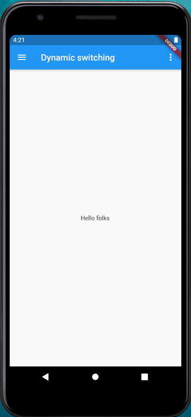
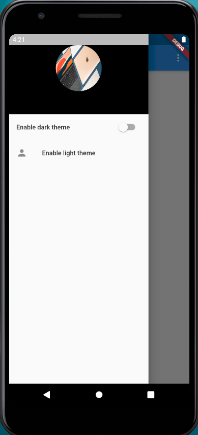
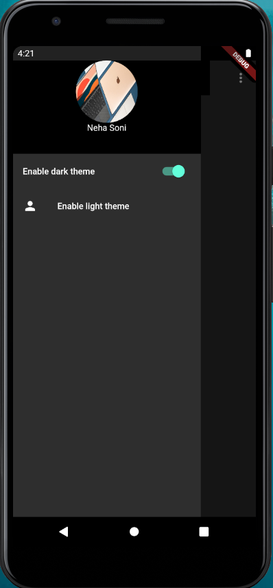
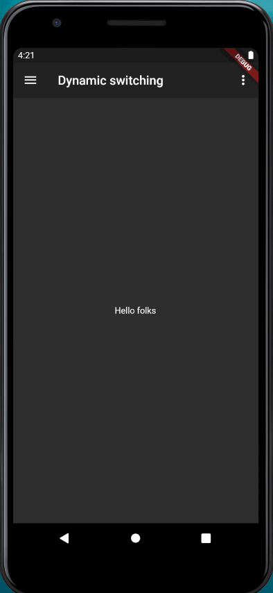
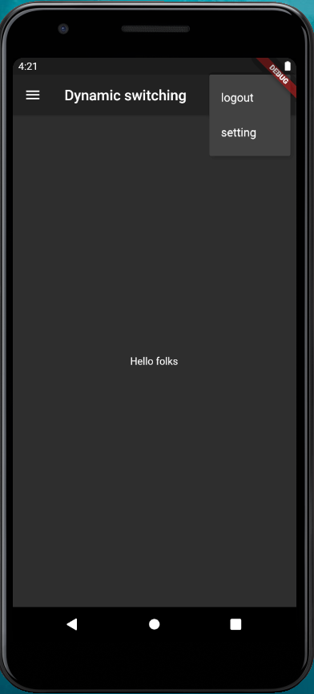

# Theme_changer_app_flutter

### About the app:-
<b>Built Using</b>
<ul><li>Flutter</li></ul>

This is the app which i built while i was learning flutter. This app was build with the help of watching a video where it was taught how to switch to dark theme dynaically in-app.
With this app just a click of ListTile you can change the theme of the app and turn it to dark mode instead. 
<b>Things which are used in this app are:-</b>
<ol>
  <li>MaterialApp design</li>
  <li>Scaffold class</li>
  <li>AppBar</li>
  <li>Stateless and Stateful widget.</li>
  <li>Use of functions and variables.</li>
  <li>Use of Drawer,ListTile and Bloc.</li>
</ol>

<b>Some Snaps from the App:-</b>

 &nbsp; &nbsp;  &nbsp; &nbsp; &nbsp; &nbsp;  &nbsp; &nbsp;
 &nbsp; &nbsp;  &nbsp; &nbsp; &nbsp; &nbsp;  &nbsp; &nbsp;
 &nbsp; &nbsp;  &nbsp; &nbsp; &nbsp; &nbsp;  &nbsp; &nbsp;  

 &nbsp; &nbsp;  &nbsp; &nbsp; &nbsp; &nbsp;  &nbsp; &nbsp;
  &nbsp; &nbsp;  &nbsp; &nbsp; &nbsp; &nbsp;  &nbsp; &nbsp;
  

  <h4>Developed By Neha Soni, Taught By <a href="https://github.com/harshkumarkhatri">Harsh Kumar Khatri</a></h4>

## Show some ❤️ and ⭐ the repo if you find it useful.
 ### Getting Started
This project is a starting point for a Flutter application.
 
A few resources to get you started if this is your first Flutter project:
<ul>
 <li>
  <a href="https://flutter.dev/docs/get-started/codelab">Lab: Write your first Flutter app</a>
 </li>
 <li>
  <a href="https://flutter.dev/docs/cookbook">Cookbook: Useful Flutter samples</a>
 </li>
 </ul>
For help getting started with Flutter, view our <a href="https://flutter.dev/docs">online documentation</a>, which offers tutorials, samples, guidance on mobile development, and a full API reference.
